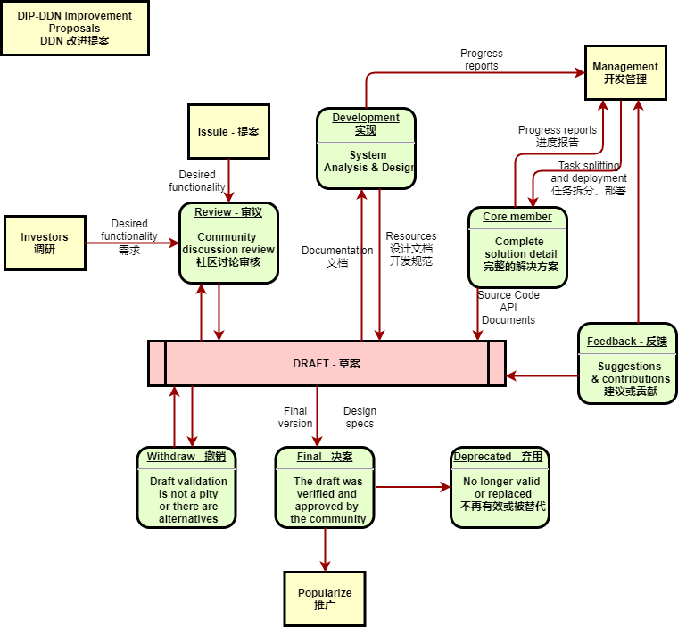

# DIPs
DDN Improvement Proposals 

## What is a DIP?

DIP stands for DDN Improvement Proposal. A DIP is a design document providing information to the DDN community, or describing a new feature for DDN or its processes or environment. The DIP should provide a concise technical specification of the feature and a rationale for the feature. The DIP author is responsible for building consensus within the community and documenting dissenting opinions.

## DIP Types

There are four types of DIP:

- **Core**: improvements requiring a consensus fork (e.g. [DIP-5](./Dip-5.md), [DIP-101](./Dip-101.md)), as well as changes that are not necessarily consensus critical but may be relevant to [“core dev” discussions](https://github.com/DDN/pm) (for example, [DIP-90], and the miner/node strategy changes 2, 3, and 4 of [DIP-86](./Dip-86.md)).
- **Networking**: includes improvements around [p2p] and [Light DDN Subprotocol], as well as proposed improvements to network protocol specifications.
- **Interface**: includes improvements around client [API] specifications and standards, and also certain language-level standards like method names and [contract instruction]. The label “interface” aligns with the [interfaces repo] and discussion should primarily occur in that repository before a DIP is submitted to the DIPs repository.
- **DRC**: application-level standards and conventions, including contract standards such as token standards ([NFT]), name registries URI schemes, library/package formats, and wallet formats.

It is highly recommended that a single DIP contain a single key proposal or new idea. The more focused the DIP, the more successful it tends to be. A change to one client doesn't require a DIP; a change that affects multiple clients, or defines a standard for multiple apps to use, does.

A DIP must meet certain minimum criteria. It must be a clear and complete description of the proposed enhancement. The enhancement must represent a net improvement. The proposed implementation, if applicable, must be solid and must not complicate the protocol unduly.

## DIP Mechanism

### DIP process

### writing a DIP

Before you begin writing a formal DIP, you should vet your idea. Ask the DDN community first if an idea is original to avoid wasting time on something that will be rejected based on prior research. It is thus recommended to open a discussion thread on [the DDN Magicians forum] to do this, but you can also use [one of the DDN Gitter chat rooms], [the DDN subreddit] or [the Issues section of this repository]. 

Once the idea has been vetted, your next responsibility will be to present (by means of a DIP) the idea to the reviewers and all interested parties, invite editors, developers, and the community to give feedback on the aforementioned channels. You should try and gauge whether the interest in your DIP is commensurate with both the work involved in implementing it and how many parties will have to conform to it. For example, the work required for implementing a Core DIP will be much greater than for a DRC and the DIP will need sufficient interest from the DDN client teams. Negative community feedback will be taken into consideration and may prevent your DIP from moving past the Draft stage.

## DIP structure?

Each DIP should have the following parts:

- Preamble - RFC 822 style headers containing metadata about the DIP, including the DIP number, a short descriptive title (limited to a maximum of 44 characters), and the author details. See [below](./Dip-1.md#Dip-header-preamble) for details.
- Summary - A short (~200 word) description of the technical issue being addressed.
- Motivation (*optional) - A motivation section is critical for DIPs that want to change the DDN protocol. It should clearly explain why the existing protocol specification is inadequate to address the problem that the DIP solves. DIP submissions without sufficient motivation may be rejected outright.
- Specification - The technical specification should describe the syntax and semantics of any new feature. The specification should be detailed enough to allow competing, interoperable implementations for any of the current DDN platforms (cpp-DDN, go-DDN, parity, DDNJ, DDNjs-lib, [and others](https://github.com/DDN/wiki/wiki/Clients).
- Rationale - The rationale fleshes out the specification by describing what motivated the design and why particular design decisions were made. It should describe alternate designs that were considered and related work, e.g. how the feature is supported in other languages. The rationale may also provide evidence of consensus within the community, and should discuss important objections or concerns raised during discussion.
- Backwards Compatibility - All DIPs that introduce backwards incompatibilities must include a section describing these incompatibilities and their severity. The DIP must explain how the author proposes to deal with these incompatibilities. DIP submissions without a sufficient backwards compatibility treatise may be rejected outright.
- Test Cases - Test cases for an implementation are mandatory for DIPs that are affecting consensus changes. Tests should either be inlined in the DIP as data (such as input/expected output pairs, or included in `../assets/Dip-###/<filename>`.
- Reference Implementation - An optional section that contains a reference/example implementation that people can use to assist in understanding or implementing this specification.
- Security Considerations - All DIPs must contain a section that discusses the security implications/considerations relevant to the proposed change. Include information that might be important for security discussions, surfaces risks and can be used throughout the life-cycle of the proposal. E.g. include security-relevant design decisions, concerns, important discussions, implementation-specific guidance and pitfalls, an outline of threats and risks and how they are being addressed. DIP submissions missing the "Security Considerations" section will be rejected. A DIP cannot proceed to status "Final" without a Security Considerations discussion deemed sufficient by the reviewers.
- Copyright Waiver - All DIPs must be in the public domain. See the bottom of this DIP for an example copyright waiver.

## DIP Formats and Templates

DIPs should be written in [markdown] format. There is a [template](https://github.com/DDN/DIPs/master/dip-template.md) to follow.

## DIP Header Preamble

Each DIP must begin with an [RFC 822](https://www.ietf.org/rfc/rfc822.txt) style header preamble, preceded and followed by three hyphens (`---`). This header is also termed ["front matter" by Jekyll](https://jekyllrb.com/docs/front-matter/). The headers must appear in the following order. Headers marked with "*" are optional and are described below. All other headers are required.

` Dip:` *DIP number* (this is determined by the DIP editor)

` title:` *DIP title*

` author:` *a list of the author's or authors' name(s) and/or username(s), or name(s) and email(s). Details are below.*

` status:` *Draft, Review, Last Call, Final, Stagnant, Withdrawn, Living*

`* review-period-end:` *date review period ends*

` type:` *Standards Track, Meta, or Informational*

` created:` *date created on*

` * updated:` *comma separated list of dates*

` * requires:` *DIP number(s)*

` * replaces:` *DIP number(s)*

` * superseded-by:` *DIP number(s)*

Headers that permit lists must separate elements with commas.

Headers requiring dates will always do so in the format of ISO 8601 (yyyy-mm-dd).

#### `author` header

The `author` header lists the names, email addresses or usernames of the authors/owners of the DIP. Those who prefer anonymity may use a username only, or a first name and a username. The format of the `author` header value must be:

> Random J. User &lt;address@dom.ain&gt;

or

> Random J. User (@username)

if the email address or GitHub username is included, and

> Random J. User

if the email address is not given.

It is not possible to use both an email and a GitHub username at the same time. If important to include both, one could include their name twice, once with the GitHub username, and once with the email.

At least one author must use a GitHub username, in order to get notified on change requests and have the capability to approve or reject them.

#### `type` header

The `type` header specifies the type of DIP: DRC, Core, interface, or netorking. 

#### `created` header

The `created` header records the date that the DIP was assigned a number. Both headers should be in yyyy-mm-dd format, e.g. 2001-08-14.

#### `updated` header

The `updated` header records the date(s) when the DIP was updated with "substantial" changes. This header is only valid for DIPs of Draft and Active status.

#### `requires` header

DIPs may have a `requires` header, indicating the DIP numbers that this DIP depends on.

#### `superseded-by` and `replaces` headers

DIPs may also have a `superseded-by` header indicating that a DIP has been rendered obsolete by a later document; the value is the number of the DIP that replaces the current document. The newer DIP must have a `replaces` header containing the number of the DIP that it rendered obsolete.

## Linking to other DIPs

References to other DIPs should follow the format `DIP-N` where `N` is the DIP number you are referring to.  Each DIP that is referenced in a DIP **MUST** be accompanied by a relative markdown link the first time it is referenced, and **MAY** be accompanied by a link on subsequent references.  The link **MUST** always be done via relative paths so that the links work in this GitHub repository, forks of this repository, the main DIPs site, mirrors of the main DIP site, etc.  For example, you would link to this DIP with `[DIP-1](./Dip-1.md)`.

## Auxiliary Files

Images, diagrams and auxiliary files should be included in a subdirectory of the `assets` folder for that DIP as follows: `assets/Dip-N` (where **N** is to be replaced with the DIP number). When linking to an image in the DIP, use relative links such as `../assets/Dip-1/image.png`.

## Transferring DIP Ownership

It occasionally becomes necessary to transfer ownership of DIPs to a new champion. In general, we'd like to retain the original author as a co-author of the transferred DIP, but that's really up to the original author. A good reason to transfer ownership is because the original author no longer has the time or interest in updating it or following through with the DIP process, or has fallen off the face of the 'net (i.e. is unreachable or isn't responding to email). A bad reason to transfer ownership is because you don't agree with the direction of the DIP. We try to build consensus around a DIP, but if that's not possible, you can always submit a competing DIP.

If you are interested in assuming ownership of a DIP, send a message asking to take over, addressed to both the original author and the DIP editor. If the original author doesn't respond to the email in a timely manner, the DIP editor will make a unilateral decision (it's not like such decisions can't be reversed :)).

## DIP Editors

The current DIP editors are

- Imfly (@imfly)
- Limsbase (@limsbase)
- Tailor (@cnTailor)
- Haoei (@haoei)

## DIP Editor Responsibilities

For each new DIP that comes in, an editor does the following:

- Read the DIP to check if it is ready: sound and complete. The ideas must make technical sense, even if they don't seem likely to get to final status.
- The title should accurately describe the content.
- Check the DIP for language (spelling, grammar, sentence structure, etc.), markup (GitHub flavored Markdown), code style

If the DIP isn't ready, the editor will send it back to the author for revision, with specific instructions.

Once the DIP is ready for the repository, the DIP editor will:

- Assign a DIP number (generally the PR number or, if preferred by the author, the Issue # if there was discussion in the Issues section of this repository about this DIP)

- Merge the corresponding pull request

- Send a message back to the DIP author with the next step.

Many DIPs are written and maintained by developers with write access to the DDN codebase. The DIP editors monitor DIP changes, and correct any structure, grammar, spelling, or markup mistakes we see.

The editors don't pass judgment on DIPs. We merely do the administrative & editorial part.

## Style Guide

When referring to a DIP by number, it should be written in the hyphenated form `DIP-X` where `X` is the DIP's assigned number.

## History

This document was derived heavily from [Bitcoin's BIP-0001] written by Amir Taaki which in turn was derived from [Python's PEP-0001]. In many places text was simply copied and modified. Although the PEP-0001 text was written by Barry Warsaw, Jeremy Hylton, and David Goodger, they are not responsible for its use in the DDN Improvement Process, and should not be bothered with technical questions specific to DDN or the DIP. Please direct all comments to the DIP editors.

## Copyright

Copyright and related rights waived via [CC0](https://creativecommons.org/publicdomain/zero/1.0/).
